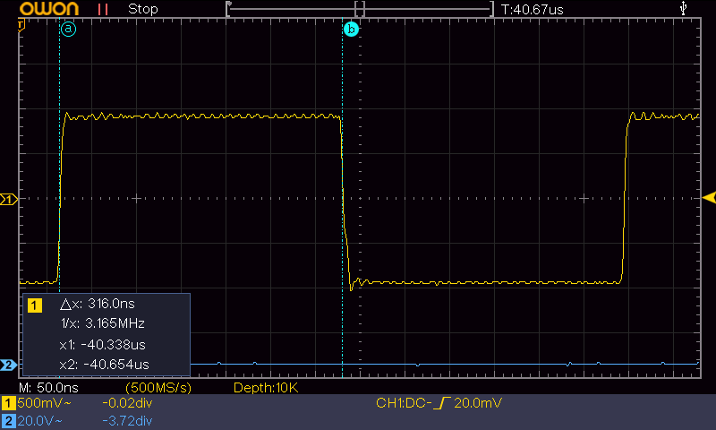
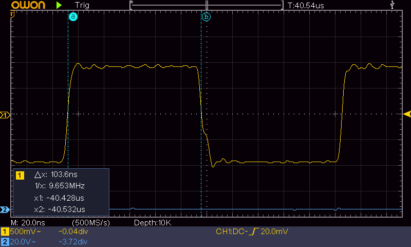
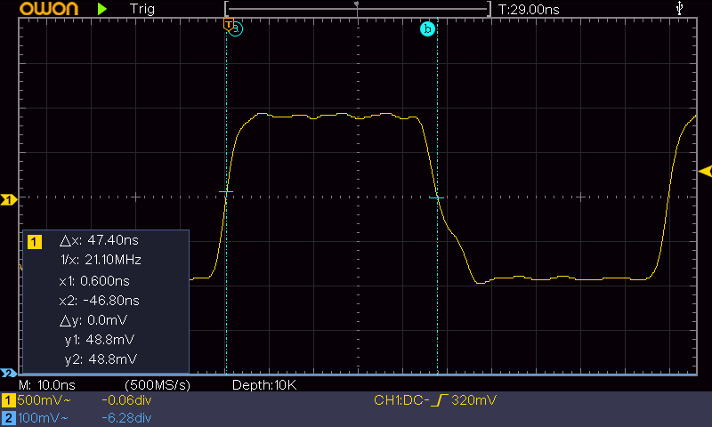
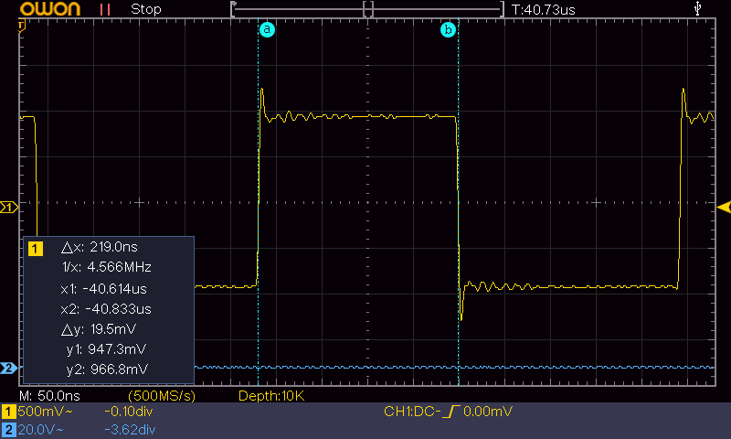
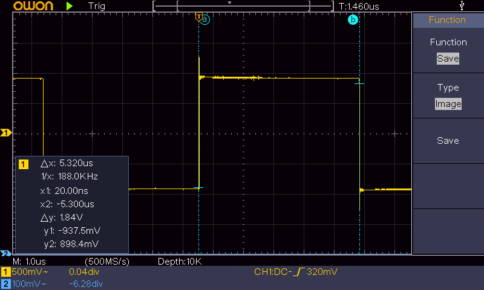

1.  Measuring GPIO pulse width on a K210 Sipeed Maix Go board
    ---------------------------------------------------------

    Goal
    ----

The goal of this is to see how fast the GPIO pins can be toggled up and
down from software. Basically all it does is:

while (1):

GPIO pin = 1

GPIO pin = 0

Purpose
-------

None, really. The raw performance of toggling GPIO pins is not all that
interesting for real world applications.

Setup:
------

-   Pin 44 is used -&gt; 1.8 V

-   Maixduino by Sipeed version 0.3.7, using version 8.2.0\_20190409 of
    the riscv compiler set

-   Kendryte\_standalone\_SDK version 0.5.4, using tool chain version
    8.2.0

-   Maixpy: MicroPython v0.1.1-114-g094cbf6 on 2019-03-18; Sipeed\_M1
    with kendryte-k210

    1.  Results:
        --------

The results from the measurements (see below) is:

  -------------------- ------------------
  GPIOHS minimal SDK   47 ns
  GPIOHS with SDK      104 ns
  Maixduino            219 ns
  GPIO with SDK        316 ns
  Maixpy               5.5 µs - 7.16 µs
  -------------------- ------------------

The conclusion is that going to the bare minimum produces the lowest
pulse length. However, being able to have high level, general, SDK code
available makes programming much more easy. What is noteworthy in that
respect is that the Maixduino effort produced a reasonably high level
programming environment with good toggle speeds.

GPIO with SDK
=============

With the following program, the length of the pulse is measured on an
oscilloscope:

\#include &lt;gpio.h&gt;

\#include &lt;fpioa.h&gt;

int main() {

fpioa\_set\_function(44 , FUNC\_GPIO0);

gpio\_set\_drive\_mode(0 , GPIO\_DM\_OUTPUT);

while (1) {

gpio\_set\_pin(0, GPIO\_PV\_HIGH);

gpio\_set\_pin(0, GPIO\_PV\_LOW);

}

}

{width="6.299305555555556in"
height="3.779861111111111in"}

As can be seen the width of the pulse is about 316 nanoseconds.

GPIOHS with SDK
---------------

With the high speed gpio function this can be improved:

\#include &lt;gpiohs.h&gt;

\#include &lt;fpioa.h&gt;

int main() {

fpioa\_set\_function(44 , FUNC\_GPIOHS0);

gpiohs\_set\_drive\_mode(0 , GPIO\_DM\_OUTPUT);

while (1) {

gpiohs\_set\_pin(0, GPIO\_PV\_HIGH);

gpiohs\_set\_pin(0, GPIO\_PV\_LOW);

}

}

{width="6.299305555555556in"
height="3.779861111111111in"}

As can be seen, the width is now about 104 nanoseconds.

GPIOHS minimal SDK
------------------

If we use the SDK but try to minimize the number of calls we get the
code:

\#include &lt;gpiohs.h&gt;

\#include &lt;fpioa.h&gt;

int main() {

fpioa\_set\_function(44 , FUNC\_GPIOHS0);

gpiohs\_set\_drive\_mode(0 , GPIO\_DM\_OUTPUT);

uint32\_t org;

volatile uint32\_t \*bits = 0x3800100c;

while (1) {

org = (\*bits) & \~1;

\*bits = org | (GPIO\_PV\_HIGH & 1);

org = (\*bits) & \~1;

\*bits = org | (GPIO\_PV\_LOW & 1);

}

}

And the width of the pulse is now about 47 nanosecond:

{width="6.299305555555556in"
height="3.779861111111111in"}

Maixduino
---------

If we try the same with Maixduino, which uses the gpiohs in the file
".../Maixduino/hardware/k210/0.3.7/cores/arduino/wiring\_digital.c", we
get:

void setup() {

pinMode(44, OUTPUT);

}

void loop() {

digitalWrite(44, HIGH);

digitalWrite(44, LOW);

}

{width="6.299305555555556in"
height="3.779861111111111in"}The width of the pulse is now about 219
nanosecond, which is double that of using the SDK directly. This
overhead is caused by a number of function calls with several statements
(and further calls) within those functions: loop, digitalWrite,
getGpio\_s.

Maixpy
------

In Maixpy we can also use the high speed gpio's:

from Maix import GPIO

fm.register(board\_info.DVP\_PWDN, fm.fpioa.GPIOHS1)

pin\_44 = GPIO(GPIO.GPIOHS1, GPIO.OUT)

while (True):

.....pin\_44.value(0)

.....pin\_44.value(1)

And we get a minimal pulse width of about 5.3 microsecond. But there is
a lot of jitter. Often the pulse width is 5.5 microsecond, and sometimes
even as high as 7.16 microsecond. This jitter may come from the FreeRTOS
producing interrupts.

{width="6.299305555555556in"
height="3.779861111111111in"}
